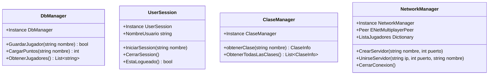

# Manual de Arquitectura y Estructura

Este documento detalla la arquitectura de software del proyecto, describiendo cómo se organiza el código, los sistemas globales (**Autoloads**) y las dependencias importantes.

---

## 📂 Organización de Carpetas

El proyecto sigue una estructura limpia, separando recursos visuales de la lógica de programación:

* **/Assets:** Contiene todos los archivos multimedia del juego (modelos 3D, sprites, audios, fuentes y videos).
  * **Video/fondo_ligero.ogv:** Video que se reproduce en bucle en el fondo de las pantallas del menú.
* **/Config:** Archivos de configuración del proyecto Godot.
* **/Prefabs:** Escenas reutilizables que funcionan como componentes (ej. botones pre-estilizados, plantillas de UI).
* **/Scenes:** Escenas principales del juego.
  * **/UI:** Pantallas de interacción como `MainMenu.tscn`, `MultiplayerMenu.tscn`, `CreateGame.tscn`, `JoinGame.tscn`, y `SeleccionClase.tscn`.
  * **/Networking:** Contiene `Lobby.tscn`, que es la sala de espera para la sincronización de red.
* **/Scripts:** Código C# dividido según su responsabilidad:
  * **/UI:** Scripts controladores que manejan la entrada del usuario en las pantallas.
  * **/Networking:** Gestión de la lógica de red y del lobby multijugador.
  * **/Managers:** Gestores globales persistentes (Base de Datos, Sesión de Usuario, Configuración de Clases).

---

## ⚙️ Sistemas Globales (Autoloads / Singletons)

Los Autoloads de Godot son nodos que se instancian al arrancar el motor y persisten a lo largo de todo el ciclo de vida del juego, independientemente de qué escena esté activa. En C#, los implementamos utilizando el patrón **Singleton**.

Aquí está el catálogo de los 4 gestores esenciales registrados en `project.godot`:

### 1. `DbManager.cs`
* **Ruta:** `res://Scripts/Managers/DbManager.cs`
* **Responsabilidad:** Gestiona la inicialización de SQLite y las consultas locales.
* **Características Clave:**
  * Al iniciar, crea la base de datos `user://jugadores.db` usando la ruta absoluta segura del sistema (`ProjectSettings.GlobalizePath`).
  * Expone métodos para registrar/actualizar jugadores y recuperar sus puntajes.

### 2. `UserSession.cs`
* **Ruta:** `res://Scripts/Managers/UserSession.cs`
* **Responsabilidad:** Mantiene el estado en memoria del usuario que está jugando actualmente.
* **Características Clave:**
  * Permite saber si hay una sesión iniciada (`EstaLogueado()`).
  * Guarda temporalmente el nombre del usuario sin persistencia (esto evita consultas repetitivas a la base de datos en tiempo de juego).

### 3. `ClaseManager.cs`
* **Ruta:** `res://Scripts/Managers/ClaseManager.cs`
* **Responsabilidad:** Repositorio central de información sobre las clases del juego (Guerrero, Mago, Arquero).
* **Características Clave:**
  * Define los atributos de descripción, habilidades y ventajas de cada personaje mediante la clase interna `ClaseInfo` (un DTO/Value Object inmutable).

### 4. `NetworkManager.cs`
* **Ruta:** `res://Scripts/Networking/NetworkManager.cs`
* **Responsabilidad:** Coordina todo el tráfico de red de alto y bajo nivel usando ENet.
* **Características Clave:**
  * Almacena diccionarios estáticos con la lista de jugadores conectados y sus estados de preparación ("listo").
  * Emite señales de Godot cuando ocurren cambios en la red para que la interfaz de usuario se actualice reactivamente.

---

## 🔗 Dependencias de Nodos en UI (Hardcodeadas)

> [!WARNING]
> La interfaz de usuario (scripts en `Scripts/UI/`) utiliza rutas directas a los nodos del árbol de escenas (método `GetNode`). Si cambias los nombres o el orden de los nodos en el editor visual de Godot, **debes actualizar obligatoriamente las rutas en el código C#**.

A continuación, se listan los nodos críticos:

| Script | Nodo en Escena | Ruta Esperada en C# |
| --- | --- | --- |
| **`MainMenu.cs`** | `PlayButton` | `CenterContainer/Panel/VBoxContainer/PlayButton` |
| | `MultiplayerButton` | `CenterContainer/Panel/VBoxContainer/MultiplayerButton` |
| | `LabelNombre` | `CenterContainer/Panel/HBoxContainer/LabelNombre` |
| **`Lobby.cs`** | `PlayerList` | `CenterContainer/Panel/VBoxContainer/PlayerList` |
| | `IniciarButton` | `CenterContainer/Panel/VBoxContainer/IniciarButton` |
| | `ListoButton` | `CenterContainer/Panel/VBoxContainer/ListoButton` |
| **`SeleccionClase.cs`** | `BtnGuerrero` | `HBoxContainer/VBoxContainer/HBoxContainer/BtnGuerrero` |
| | `LabelNombreClase` | `HBoxContainer/VBoxContainer/LabelNombreClase` |

---

## ⚠️ Aspectos Delicados a Tener en Cuenta

1. **Ciclo de vida de Base de Datos:** `DbManager` realiza las llamadas a `connection.Close()` en bloques `using`. Esto previene fugas de recursos o bloqueos del archivo SQLite. Asegúrate de replicar este patrón si añades más consultas.
2. **Acceso estático en Red:** `NetworkManager` utiliza campos `public static` para el `Peer`, `ListaJugadores` y `EstadosJugadores`. Aunque facilita el acceso global rápido, requiere una limpieza meticulosa llamando a `CerrarConexion()` al desconectarse para evitar arrastrar basura de sesiones previas.
3. **Escena Inicial:** La escena por defecto en `project.godot` es `Main.tscn`. Esta escena inicializa el árbol de nodos pero no tiene código propio; sirve como contenedor base para lanzar los Autoloads y cambiar inmediatamente a la pantalla del menú principal.
