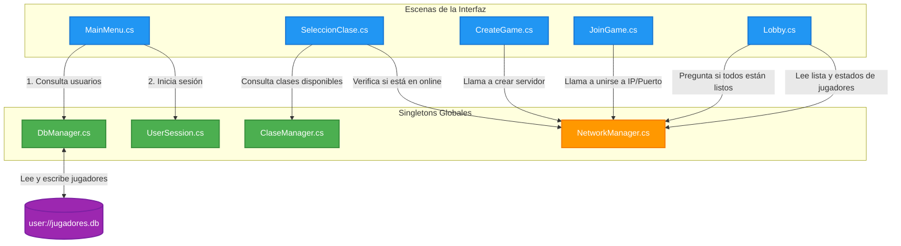
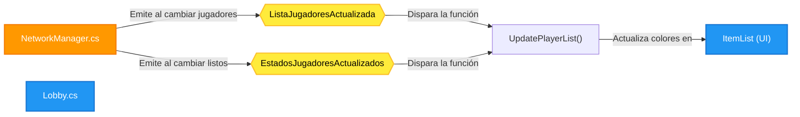
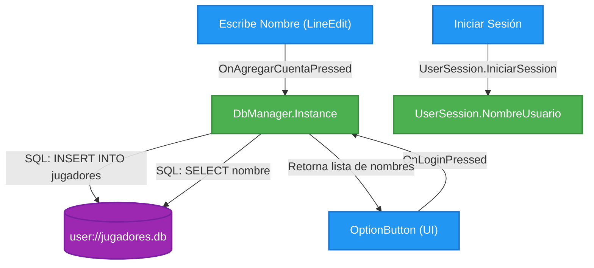
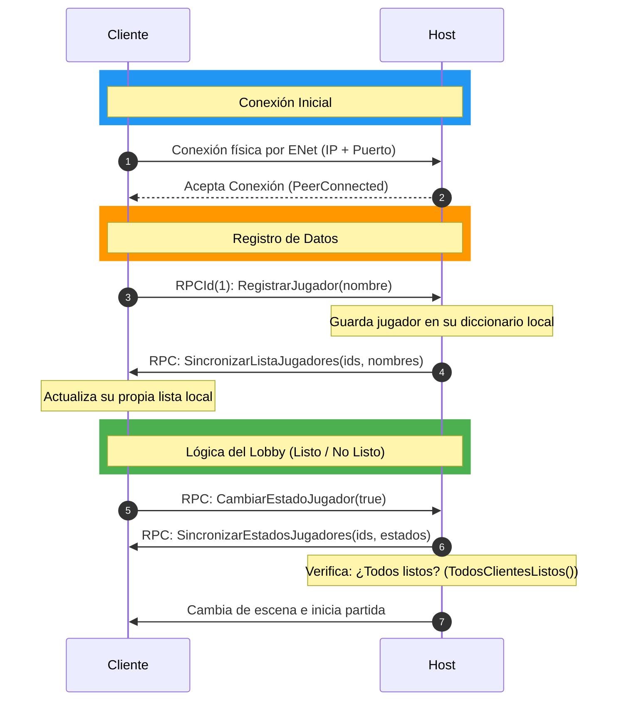

# 🗺️ Mapa Visual del Proyecto: Flujo, Variables y Red

Este documento presenta de forma gráfica y rápida la arquitectura del juego. Está diseñado con diagramas de flujo y mapas de comunicación estructurados por colores para entender el sistema de inmediato.

---

## 🎨 Leyenda de Colores de los Diagramas

* 🟩 **Verde:** Autoloads / Singletons Globales (Viven en todo el juego y guardan variables clave).
* 🟦 **Azul:** Escenas de la Interfaz (UI) y Controladores Locales.
* 🟪 **Morado:** Base de Datos local SQLite (Persistencia).
* 🟧 **Naranja:** Red, Multijugador y RPCs.
* 🟨 **Amarillo:** Señales / Eventos (Notificaciones de cambio).

---

## 🗺️ 1. Mapa de Comunicación y Variables Globales

Este diagrama muestra cómo interactúan las pantallas (UI) con los Gestores Globales y qué variables transfieren información.

---

## ⚡ 2. Mapa de Señales y Eventos (Comunicación Reactiva)

Las señales notifican a la interfaz que algo cambió para que esta se redibuje sola.

### 🎨 Colores de Jugadores en el Lobby:
* 🟢 **Verde:** Host (Siempre listo, ID de peer `1`).
* 🔴 **Rojo:** Cliente **Listo**.
* ⚪ **Blanco:** Cliente **No Listo**.

---

## 🟪 3. Flujo de Datos: Base de Datos SQLite

Así fluyen los datos cuando te registras o inicias sesión.

---

## 🟧 4. El Sistema Online (ENet + RPCs)

Las funciones marcadas con `[Rpc]` son métodos que se ejecutan en otras computadoras a través de la red.

### 📑 Resumen Rápido de Variables de Red:
* **`NetworkManager.ListaJugadores`**: Diccionario `<int, string>` que guarda `ID_Jugador -> Nombre`.
* **`NetworkManager.EstadosJugadores`**: Diccionario `<int, bool>` que guarda `ID_Jugador -> Listo(True)/NoListo(False)`.
* **`NetworkManager.JugadorNombre`**: Variable de texto con el nombre de tu usuario local en la partida.
* **`NetworkManager.PuertoServidor`**: Puerto en el que está escuchando el host.
