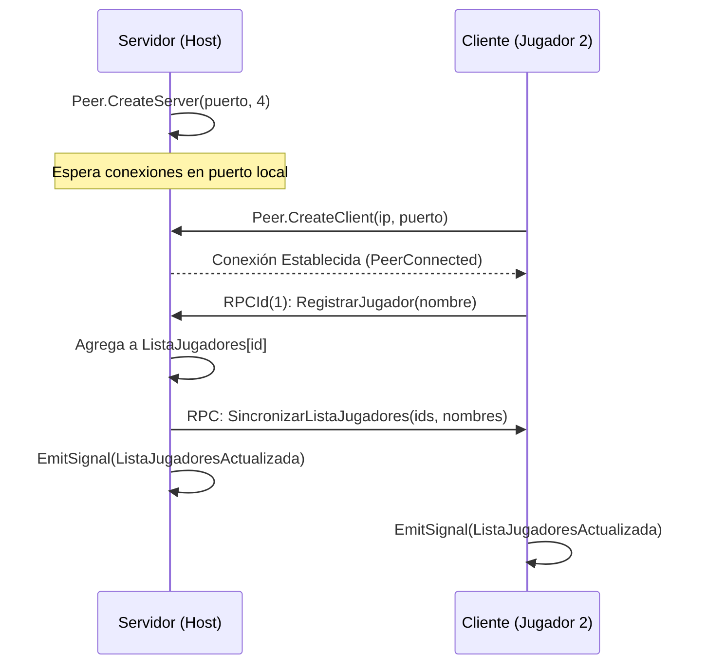
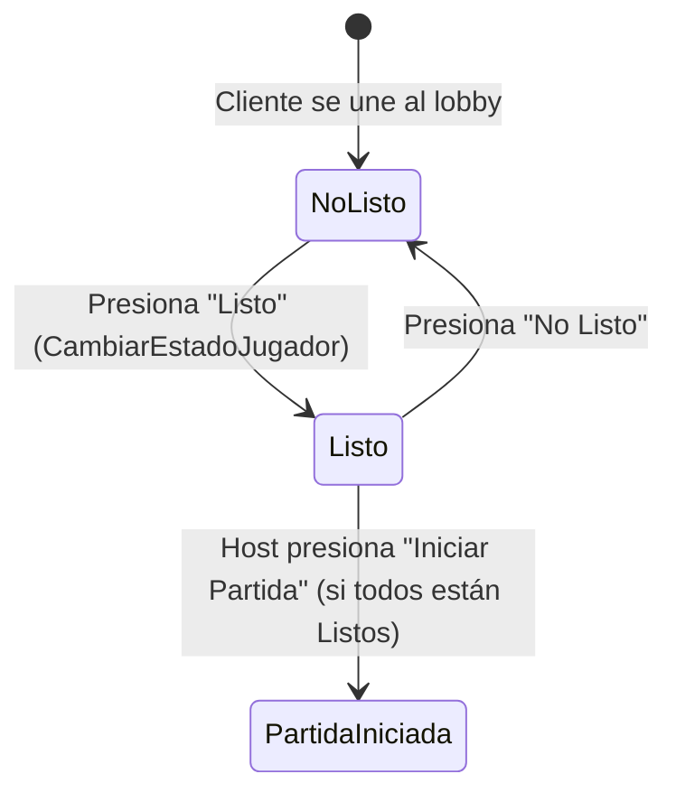

# Manual de Red y Multijugador (Lobby)

Este documento explica en detalle el sistema de red implementado en el juego, abarcando el protocolo de comunicación, el intercambio de datos entre host y clientes, y la lógica del lobby.

---

## 🔌 Protocolo ENet y Modelo de Red

El juego utiliza **ENet** (a través de `ENetMultiplayerPeer`), el cual es un protocolo de red ligero construido sobre UDP que provee:
* Entrega de paquetes ordenada y confiable (útil para eventos como chat o registro).
* Entrega de paquetes no confiable pero rápida (útil para sincronizar la posición física en el juego).

### Conexión Host vs Cliente



---

## 🔑 Sistema de Códigos en Base64

Para simplificar cómo los jugadores se unen a una partida, el Host genera un **Código de Conexión** que oculta los detalles técnicos de la dirección IP y el puerto.

### Generación del Código (Host)
Cuando se crea el servidor, `Lobby.cs` concatena la IP local y el puerto en formato `IP:PUERTO`, luego lo convierte a bytes UTF-8 y finalmente a una cadena codificada en **Base64**:
```csharp
string datos = $"{ip}:{puerto}";
byte[] bytes = Encoding.UTF8.GetBytes(datos);
string codigo = Convert.ToBase64String(bytes);
```
* **Ejemplo:** `192.168.1.15:25565` se convierte en `MTkyLjE2OC4xLjE1OjI1NTY1`

### Consumo del Código (Cliente)
En la pantalla de unión (`JoinGame.cs`), el jugador pega el código. El sistema decodifica la cadena y extrae la IP y el puerto usando:
```csharp
byte[] bytes = Convert.FromBase64String(codigo);
string datos = Encoding.UTF8.GetString(bytes);
string[] partes = datos.Split(':'); // partes[0] = IP, partes[1] = Puerto
```

---

## 👥 Registro y Sincronización (RPCs)

Las Llamadas a Procedimientos Remotos (RPC) permiten invocar métodos en máquinas conectadas a través de la red. En Godot, esto se hace decorando los métodos con `[Rpc]`.

### RPCs Clave de Red

1. **`RegistrarJugador(string nombre)`**
   * **Modo:** `AnyPeer` (llamable por cualquier cliente), `CallLocal = true`.
   * **Comportamiento:** Se ejecuta en el servidor. Asigna el ID remoto (`GetRemoteSenderId()`) al nombre. Si la sala está llena (límite de 4 jugadores), rechaza la conexión llamando a `RechazarPorLaSalaLlena`. Si no, registra al jugador y propaga la lista actualizada a todos.

2. **`SincronizarListaJugadores(int[] ids, string[] nombres)`**
   * **Modo:** `AnyPeer`, `CallLocal = true`.
   * **Comportamiento:** Reconstruye el diccionario `ListaJugadores` en todas las máquinas a partir de los arreglos enviados por el servidor, y dispara la señal para actualizar la UI del lobby.

---

## 🚦 Estados de Preparación ("Listo / No Listo")

Los clientes en el lobby deben marcarse como "Listos" antes de que el Host pueda iniciar la partida.

### Flujo de Estado "Listo"



1. Un cliente presiona el botón `ListoButton`.
2. Llama a `NetworkManager.Instance.CambiarEstadoJugador(estado)`.
3. Esto envía el diccionario actualizado a todos los peers usando `SincronizarEstadosJugadores`.
4. El servidor verifica constantemente si se cumple la condición de inicio mediante el método `TodosClientesListos()`.

### Reglas de Validación
* **Mínimo de jugadores:** Se requieren al menos **2 jugadores** (Host + 1 Cliente) para poder iniciar la partida.
* **El Host no vota:** El Host siempre se asume listo y no tiene botón de preparación, su botón es **Iniciar Partida**.

### 🎨 Visualización de Estados en la UI (Lobby)
En la lista de jugadores (`ItemList` de `Lobby.tscn`), los jugadores cambian de color según su rol y estado actual:

* 🟢 **Verde (`Colors.Green`):** Es el Host (el jugador con ID de peer `1`).
* 🔴 **Rojo (`Colors.Red`):** Es un cliente que se encuentra en estado **Listo**.
* ⚪ **Blanco (`Colors.White`):** Es un cliente que se encuentra en estado **No Listo**.
